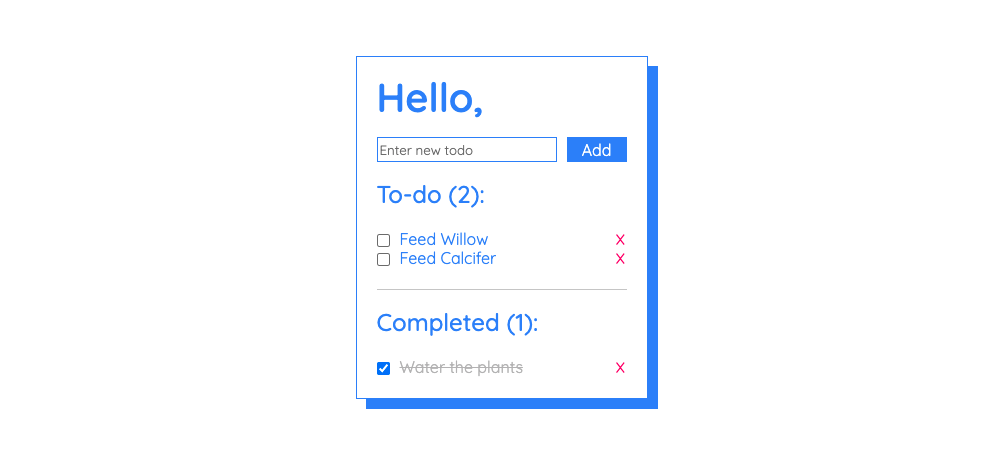

# My First Checklist App

## Premise

A simple checklist that clearly shows how many todo items you've accomplished and how many you have left to go.

Live demo: **[Checklist App](https://krystn.github.io/checkList/)**

## Features

- Clean, minimalist layout
- Counts completed and pending todo
- Delete individual todo items

## Getting Started

### **Adding a todo item**

> Enter new todo item in the text input and click `Add`

> The text input can't be empty, otherwise an alert will pop up prompting the user to write something

> When a valid todo item is submitted, it will show up under 'To-do' and will count how many items the user has left

### **Completing a todo item**

> By clicking the checkbox, the todo item gets moved to the 'Completed' section and will count how many completed items the user has

> Completing a todo item will also update the 'To-do' count

> The user can uncheck the checkbox to bring the todo item back to the 'To-do' section and the counts for both 'To-do' and 'Completed' items will be updated

### **Deleting a todo item**

> A todo item in 'To-do' and 'Completed' may be deleted after clicking the red `x`

> Deleted todo items cannot be retreived

## Upcoming Features

- Edit todo item
- Confetti animation for every completed todo item
- Night mode

### Tech Used

- Javascript
- HTML
- CSS

---

## Credits

---

### Style References

[Box Shadow](https://www.peeayecreative.com/how-to-match-divi-box-shadows-with-css/)

[Google Fonts](https://fonts.google.com/specimen/Quicksand?query=quicksand)

[Button Style](https://getcssscan.com/css-buttons-examples)
